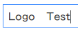

Basic Markdown Tutorials (Title)
================================

Basics (Subtitle,at least 3 '-')
--------------------------------
# 1. Section Style
# section 1
## section 2
### section 3
#### section 4
##### section 5
###### section 6

___

***


# 2.Text Style
bold <-> **bold**

italic <-> _italic_

strike <-> ~~strike~~

single 'enter' is single blank(' ')

double 'enter' is real enter


# 3.Reference Style
Talk is cheap, show me the code.

<!-- This is comment -->

This is inline code ->|`Talk is cheap, show me the code.`|<- inline code ends here.


```
#include <iostream>

int main()
{
    std::cout<< "Hello World!\n";
}
```
> Ref1
>> Ref1.1
>>> Ref1.1.1

> Ref2

> Ref3

---
Address: <Someone@company.com>

Website: [Submit your picture to get link](https://sm.ms/)

WebLinkImg: 

LocalLinkImg:

LogoWithLink:[](http://zhehua.info)
___

I get 10 times more traffic from [Google][1] than from [Yahoo][2] or [MSN][3].


# 4.Lists

+ A.
+ B.
+ C.

- A.
    - A.1
    - A.2
- B.
- C

* A(need a blank after '*')
    * A.1
    * A.2
        * A.2.1
            * A.2.1.1
            * A.2.1.2
                * (a)
                * (b)
        * A.2.2

<ol>
  <li>banana</li>
  <li>appple</li>
  <li>pear</li>
</ol>


# 5.Tables
| |AAAAAA|BBBBBB|CCCCCC|
|----|:----|:----:|----:|
|X|1|2|3|
|Y|4|5|6|

# 6.Math
> MathJax
<script type="text/javascript" src="http://cdn.mathjax.org/mathjax/latest/MathJax.js?config=default"></script>

* $$x=\frac{-b\pm\sqrt{b^2-4ac}}{2a}$$

* \\(x=\frac{-b\pm\sqrt{b^2-4ac}}{2a}\\)


> Google Chart


[1]: http://google.com/ "Google"
[2]: http://search.yahoo.com/ "Yahoo Search"
[3]: http://search.msn.com/ "MSN Search"
