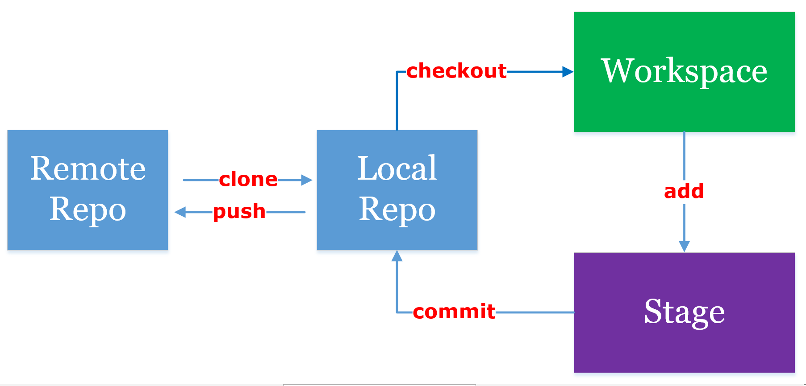

# Git usage note



# SuperFast Demo
```
touch firstfile
git add firstfile 
git commit -m "first file, OLO"
git push origin master 
```

# Create from ground
## Step 1
* Create New Project

my config
HuZhehua
huzhehua@cvslam.com

Zhehua-Humn
ZhehuaHu@163.com

git@github.com:Zhehua-Hu/Zhehua-Hu.github.io.git


* Initial Git
```
git init
GITHUB_USE_RNAME=Zhehua-Hu
GITHUB_USER_EMAIL=ZhehuaHu@163.com
PRO_NAME=Enchain
```
* Setting
```
git config --global user.name \"${GITHUB_USE_RNAME}\"
git config --global user.email \"${GITHUB_USER_EMAIL}\"
git config --global color.ui true
```

## Step 2 Adding files and commit
```
git add *
git add --all
git add <list of files>
git add <list of directory>
git add "<list>"

git commit -m "your comments"
```

## Step 3 Remote Respository
* Clone remote code
```
#SSH (This type enbale you type password no more)
git clone git@github.com:${GITHUB_USE_RNAME}/${PRO_NAME}

#HTTP (Easy to code from others)
git clone https://github.com/${GITHUB_USE_RNAME}/${PRO_NAME}	
```

* Set SSH
```
cur_pwd=`pwd`
cd ~
mkdir .ssh
cd .ssh
touch id_rsa
touch id_rsa.pub
ssh-keygen -t rsa -C \"${GITHUB_USER_EMAIL}\"
# input: ************
# copy pub key to github
ssh -T git@github.com
cd $cur_pwd
```
[ref](http://www.xuanfengge.com/using-ssh-key-link-github-photo-tour.html)

* Push local code
```
git remote add origin git@github.com:${GITHUB_USE_RNAME}/${PRO_NAME}.git
git push -u origin master
#OR
git push origin master
```
* Check
Show weblink
```
git remote -v
```

Show hostname
```
git remote show
```

Rename respositoy
```
git remote rename <origin> <new>
```

Remove respositoy
```
git remote rm hostname
```


## Step 4 Version control
### Branch
```
查看分支：git branch

创建分支：git branch <name>

切换分支：git checkout <name>

recover certain file :git checkout -- filename

创建+切换分支：git checkout -b <name>

合并某分支到当前分支：git merge <name>
(recommend)git merge --no-ff -m "merge with no-ff" <name>

删除分支：git branch -d <name>
```
### Stash work
```
git stash
git stash list
git stash pop

```


### Tag
```
git tag
git tag <name>
git show <name>

show <sha1> :git log --pretty=oneline --abbrev-commit
git tag -a <name> -m "comments" <sha1>


命令git push origin <tagname>可以推送一个本地标签；

命令git push origin --tags可以推送全部未推送过的本地标签；

命令git tag -d <tagname>可以删除一个本地标签；

命令git push origin :refs/tags/<tagname>可以删除一个远程标签。

```


### Others
```
git reset --hard HEAD~n
git reset --hard sha1(at least 4 numbers)

git rm
```
## Alias
```
git lg:
git config --global alias.lg "log --color --graph --pretty=format:'%Cred%h%Creset -%C(yellow)%d%Creset %s %Cgreen(%cr) %C(bold blue)<%an>%Creset' --abbrev-commit"
```


## Tools
```
git status
git diff
git log
git log --pretty=oneline
git log --pretty=oneline --graph --abbrev-commit
git log --pretty=oneline --abbrev-commit
```

## Reference
[廖雪峰中文教程](http://www.liaoxuefeng.com/wiki/0013739516305929606dd18361248578c67b8067c8c017b000)

[Git远程操作详解](http://www.ruanyifeng.com/blog/2014/06/git_remote.html)

[GotGitHub](http://www.worldhello.net/gotgithub/)

[English Tutorial](https://try.github.io)


git@github.com:Zhehua-Hu/Enchain.wiki.git


## Sources
travis

List:<http://shields.io/>
